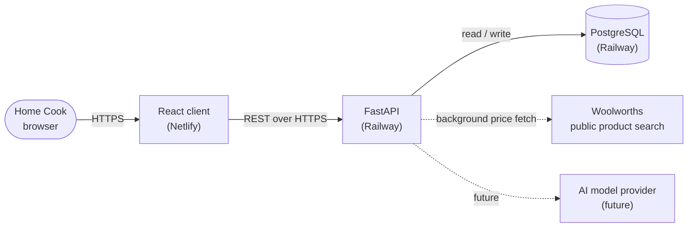
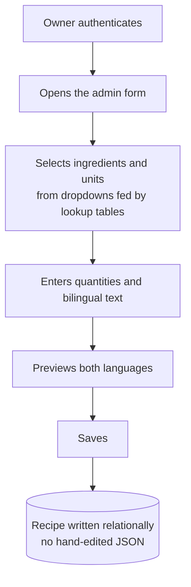
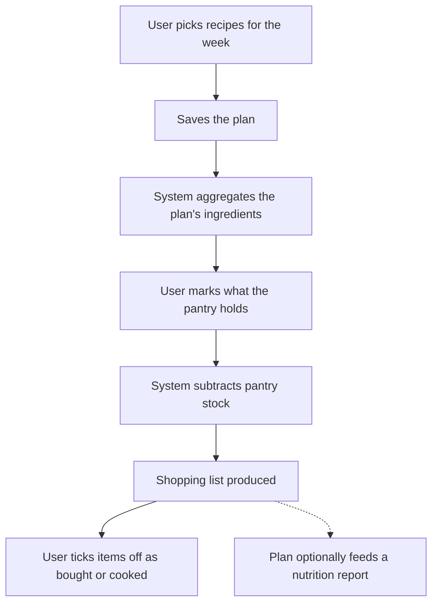

# Architecture

## System context

The browser loads the React client from Netlify. The client calls the FastAPI backend over HTTPS. The backend reads and writes PostgreSQL. A background process fetches indicative prices from Woolworths' public search and caches them in the database, so nothing third-party is called on page load. Two future actors are shown dotted: a nutrition calculation process, and the AI assistant calling an external model provider from the backend.

## Process — create a bilingual recipe (target, Phase 2)

## Process — weekly meal prep to shopping list (target, Phase 4)

This second flow depends on two things: the relational ingredient model, to aggregate quantities, and user accounts, to hold a personal plan and pantry.

## Localisation approach

User-facing strings live in a single source of truth and are keyed by language. Components read the active language from a shared prop rather than holding their own copies. Right-to-left layout is driven by a body-level class so that switching language flips the whole page in one place. Recipe content falls back to English where an Arabic value is missing, so a partly translated recipe still renders.
