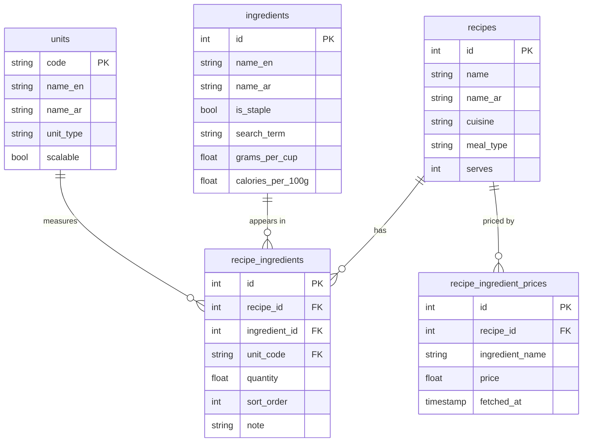

# Data Model

This is the headline piece of analysis. Ingredient quantities are moving from free text into a relational model, because three planned capabilities depend on quantities the code can read.

## Current state

The `recipes` table stores ingredients as JSON in the shape:

```json
[
  { "group": "Sauce", "items": [ { "amount": "250 g", "name": "plain yoghurt" } ] }
]
```

`amount` is a single text field, such as `"250 g"` or `"2 cloves"`. Arabic ingredients live in a parallel `ingredients_ar` JSON. Prices sit in `recipe_ingredient_prices`, search terms in `ingredient_search_terms`, and the staple logic lives in code.

This works for display. It cannot support scaling, nutrition, or shopping, because the quantity is text, not a number. You cannot double `"250 g"` or sum `"2 cloves"` across recipes without first parsing it, and parsing free text reliably is the problem the restructure removes.

## Target state (Foundation)

Three tables replace the JSON.

### `units`

| Column | Type | Notes |
|---|---|---|
| code | string (PK) | tbsp, tsp, cup, g, kg, clove, pinch, to_taste |
| name_en | string | tablespoon |
| name_ar | string | ملعقة كبيرة |
| unit_type | string | weight, volume, count, informal |
| scalable | boolean | false for pinch and to_taste |

### `ingredients`

| Column | Type | Notes |
|---|---|---|
| id | serial (PK) | |
| name_en | string | plain yoghurt |
| name_ar | string | replaces the parallel Arabic JSON |
| is_staple | boolean | absorbs the staples logic from code |
| search_term | string | absorbs `ingredient_search_terms` |
| calories_per_100g | float, null | |
| protein_per_100g | float, null | |
| carbs_per_100g | float, null | |
| fat_per_100g | float, null | |
| grams_per_cup | float, null | weight of one cup of this ingredient |
| grams_per_tbsp | float, null | weight of one tbsp of this ingredient |
| grams_per_unit | float, null | weight of one whole item, for count units |

The gram-conversion columns sit on the ingredient, not the unit, because a cup of flour and a cup of water weigh different amounts. Nutrition is stored per 100g, so a recipe line converts to grams first, then applies the per-100g figure.

### `recipe_ingredients`

| Column | Type | Notes |
|---|---|---|
| id | serial (PK) | |
| recipe_id | FK → recipes.id | |
| group_name | string, null | preserves the existing grouping |
| sort_order | integer | preserves order |
| quantity | float, null | null for "to taste" lines |
| unit_code | FK → units.code, null | |
| ingredient_id | FK → ingredients.id | |
| note | string, null | "peeled and sliced" |

The old `ingredients` and `ingredients_ar` JSON columns are kept as a fallback until the new path is verified, then dropped in a later, separate migration. No drop-and-recreate.

## ERD



## What this unlocks

Once a recipe line is `quantity` + `unit` + `ingredient`, three features become straightforward reads rather than text parsing:

- **Scaling.** Multiply `quantity` for scalable units; leave `to taste` and `pinch` alone.
- **Nutrition.** Convert the line to grams via the ingredient's gram-conversion column, then apply the per-100g figures.
- **Shopping.** Sum the same ingredient across a week's recipes, subtract pantry stock, and produce a list.

That dependency is why Foundation comes before the features that sit on top of it.
